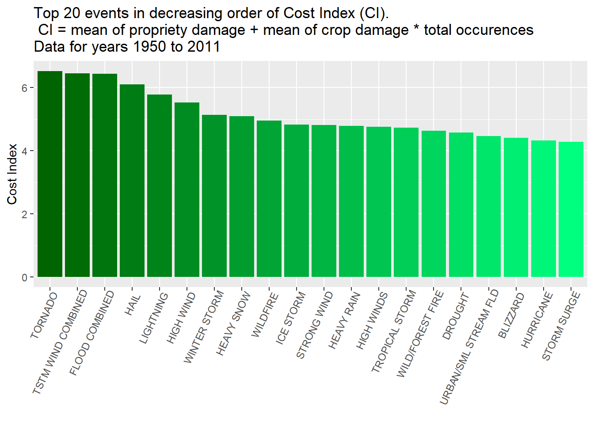

## Synopsis
The file "Storm Data" comes from the U.S. National Oceanic and Atmospheric  
Administration's (NOAA) and was accessible at [this url](https://d396qusza40orc.cloudfront.net/repdata%2Fdata%2FStormData.csv.bz2) on oct. 2nd 2019.  
  
The goal of the assessment is to produce a report that points at the most  
harmful and most costly meteorological events across the US for the years we  
have access to (1950 - 2011).  
  
More details can be found in the README.md file at [this GitHub url](https://github.com/Ravenpsycho/RepData_PeerAssessment2)

## Data Processing

### Data Loading  
We will begin by taking a look at the data:

```r
# Downloading file (47Mb, might take a while depending on the connection and speeds)
# note that this step is cached and will be executed much faster if repeated:
myurl <- "https://d396qusza40orc.cloudfront.net/repdata%2Fdata%2FStormData.csv.bz2"
if (!file.exists("Storm_Data.csv.bz2")){
        download.file(myurl, destfile = "Storm_Data.csv.bz2")
}
# Reading in the dataframe, again, might take a while.
if (!exists("StormData")){
        StormData <- read.csv("Storm_Data.csv.bz2")
}
str(StormData)
```

```
## 'data.frame':	902297 obs. of  37 variables:
##  $ STATE__   : num  1 1 1 1 1 1 1 1 1 1 ...
##  $ BGN_DATE  : Factor w/ 16335 levels "1/1/1966 0:00:00",..: 6523 6523 4242 11116 2224 2224 2260 383 3980 3980 ...
##  $ BGN_TIME  : Factor w/ 3608 levels "00:00:00 AM",..: 272 287 2705 1683 2584 3186 242 1683 3186 3186 ...
##  $ TIME_ZONE : Factor w/ 22 levels "ADT","AKS","AST",..: 7 7 7 7 7 7 7 7 7 7 ...
##  $ COUNTY    : num  97 3 57 89 43 77 9 123 125 57 ...
##  $ COUNTYNAME: Factor w/ 29601 levels "","5NM E OF MACKINAC BRIDGE TO PRESQUE ISLE LT MI",..: 13513 1873 4598 10592 4372 10094 1973 23873 24418 4598 ...
##  $ STATE     : Factor w/ 72 levels "AK","AL","AM",..: 2 2 2 2 2 2 2 2 2 2 ...
##  $ EVTYPE    : Factor w/ 985 levels "   HIGH SURF ADVISORY",..: 834 834 834 834 834 834 834 834 834 834 ...
##  $ BGN_RANGE : num  0 0 0 0 0 0 0 0 0 0 ...
##  $ BGN_AZI   : Factor w/ 35 levels "","  N"," NW",..: 1 1 1 1 1 1 1 1 1 1 ...
##  $ BGN_LOCATI: Factor w/ 54429 levels "","- 1 N Albion",..: 1 1 1 1 1 1 1 1 1 1 ...
##  $ END_DATE  : Factor w/ 6663 levels "","1/1/1993 0:00:00",..: 1 1 1 1 1 1 1 1 1 1 ...
##  $ END_TIME  : Factor w/ 3647 levels ""," 0900CST",..: 1 1 1 1 1 1 1 1 1 1 ...
##  $ COUNTY_END: num  0 0 0 0 0 0 0 0 0 0 ...
##  $ COUNTYENDN: logi  NA NA NA NA NA NA ...
##  $ END_RANGE : num  0 0 0 0 0 0 0 0 0 0 ...
##  $ END_AZI   : Factor w/ 24 levels "","E","ENE","ESE",..: 1 1 1 1 1 1 1 1 1 1 ...
##  $ END_LOCATI: Factor w/ 34506 levels "","- .5 NNW",..: 1 1 1 1 1 1 1 1 1 1 ...
##  $ LENGTH    : num  14 2 0.1 0 0 1.5 1.5 0 3.3 2.3 ...
##  $ WIDTH     : num  100 150 123 100 150 177 33 33 100 100 ...
##  $ F         : int  3 2 2 2 2 2 2 1 3 3 ...
##  $ MAG       : num  0 0 0 0 0 0 0 0 0 0 ...
##  $ FATALITIES: num  0 0 0 0 0 0 0 0 1 0 ...
##  $ INJURIES  : num  15 0 2 2 2 6 1 0 14 0 ...
##  $ PROPDMG   : num  25 2.5 25 2.5 2.5 2.5 2.5 2.5 25 25 ...
##  $ PROPDMGEXP: Factor w/ 19 levels "","-","?","+",..: 17 17 17 17 17 17 17 17 17 17 ...
##  $ CROPDMG   : num  0 0 0 0 0 0 0 0 0 0 ...
##  $ CROPDMGEXP: Factor w/ 9 levels "","?","0","2",..: 1 1 1 1 1 1 1 1 1 1 ...
##  $ WFO       : Factor w/ 542 levels ""," CI","$AC",..: 1 1 1 1 1 1 1 1 1 1 ...
##  $ STATEOFFIC: Factor w/ 250 levels "","ALABAMA, Central",..: 1 1 1 1 1 1 1 1 1 1 ...
##  $ ZONENAMES : Factor w/ 25112 levels "","                                                                                                               "| __truncated__,..: 1 1 1 1 1 1 1 1 1 1 ...
##  $ LATITUDE  : num  3040 3042 3340 3458 3412 ...
##  $ LONGITUDE : num  8812 8755 8742 8626 8642 ...
##  $ LATITUDE_E: num  3051 0 0 0 0 ...
##  $ LONGITUDE_: num  8806 0 0 0 0 ...
##  $ REMARKS   : Factor w/ 436781 levels "","-2 at Deer Park\n",..: 1 1 1 1 1 1 1 1 1 1 ...
##  $ REFNUM    : num  1 2 3 4 5 6 7 8 9 10 ...
```
  
### Check for NA's
  
From the above call to `str()` function, the database seems pretty organized.  
Let's check for missing values:

```r
na_check <- lapply(StormData, is.na)
na_check <- lapply(na_check, sum)
sort(unlist(na_check), decreasing = T)
```

```
## COUNTYENDN          F   LATITUDE LATITUDE_E    STATE__   BGN_DATE 
##     902297     843563         47         40          0          0 
##   BGN_TIME  TIME_ZONE     COUNTY COUNTYNAME      STATE     EVTYPE 
##          0          0          0          0          0          0 
##  BGN_RANGE    BGN_AZI BGN_LOCATI   END_DATE   END_TIME COUNTY_END 
##          0          0          0          0          0          0 
##  END_RANGE    END_AZI END_LOCATI     LENGTH      WIDTH        MAG 
##          0          0          0          0          0          0 
## FATALITIES   INJURIES    PROPDMG PROPDMGEXP    CROPDMG CROPDMGEXP 
##          0          0          0          0          0          0 
##        WFO STATEOFFIC  ZONENAMES  LONGITUDE LONGITUDE_    REMARKS 
##          0          0          0          0          0          0 
##     REFNUM 
##          0
```
  
We can see that the database is an "all or nothing" type: either a variable  
has (almost) all it's values filled in, or almost all the data is missing.  
  
Fortunately, in the "missing" camp, we have only two variables `F` and  
`COUNTYENDN`. Since these variables don't seem to be relevant to the questions  
at hands, we won't have to take further actions in their regard.  
  
### Data modifications

This will require some packages, let's load them:

```r
library(dplyr)
```

```
## 
## Attaching package: 'dplyr'
```

```
## The following objects are masked from 'package:stats':
## 
##     filter, lag
```

```
## The following objects are masked from 'package:base':
## 
##     intersect, setdiff, setequal, union
```

```r
library(ggplot2)
library(reshape2)
library(pdftools)
library(stringr)
library(stringdist)
```
  
Let's first create a second database, `StormData_mod`, for three main reasons:  
  
1. We avoid having to rebuild the original (and heavy) dataframe with every knit.  
2. We can keep track of changes if needed.  
3. We can subset the original dataframe to work faster.  

We will start by subsetting by date > 01.01.1996. Why? Because this is when  
people started tracking all 48 events, not just some of them (cf [this thread](https://www.coursera.org/learn/reproducible-research/discussions/weeks/4/threads/38y35MMiEeiERhLphT2-QA)).  

We'll keep only the variables we will later use as well.
  

```r
testdate <- as.POSIXlt(
                as.character(StormData$BGN_DATE),
                format = "%m/%d/%Y %H:%M:%S") > "1996-01-01"
conditions <- (StormData$CROPDMG > 0 | StormData$PROPDMG > 0 |
                       StormData$INJURIES > 0 | StormData$FATALITIES > 0) & testdate 
StormData_mod <- subset(StormData, conditions)
StormData_mod <- StormData_mod[,c("EVTYPE","INJURIES", "FATALITIES", "CROPDMG", "CROPDMGEXP",
                              "PROPDMG", "PROPDMGEXP")]
```
  
After some exploration, we can notice something about `EVTYPE`. There are  
duplicates. For example: `THUNDERSTORM WIND` appears a whole lot of times under  
slightly different names.  
  
This is a problem. Events will need to be grouped under the official  
48 names below (found in the pdf file in code, from a link provided  
on Coursera):  
  

```r
pdf_url <- paste0("https://d396qusza40orc.cloudfront.net/",
                  "repdata%2Fpeer2_doc%2Fpd01016005curr.pdf")
my_pdf <- 
        paste0(pdf_text(pdf_url)[c(2:4)])
my_str <- unlist(strsplit(my_pdf, "(\\r)?\\n"))
my_str <- my_str[47:128]
my_str_short <- 
        str_match(string = my_str, 
                  pattern = "7.([0-9]+)[.]? +(.*?) *(?:[(][A-Z][)])? *[.]{3,}")
my_str_short <- toupper(my_str_short[!is.na(my_str_short[,3]),3])
rm(my_pdf, my_str)
my_str_long <- data.frame(Value = c(1:4, 
                                    rep(5,2), 6:12,
                                    rep(13,2), 14:16,
                                    rep(17,2), 18:24, 
                                    rep(25,2), 26:48), 
                          name = unlist(strsplit(my_str_short, "[/]")))
print(my_str_short)
```

```
##  [1] "ASTRONOMICAL LOW TIDE"    "AVALANCHE"               
##  [3] "BLIZZARD"                 "COASTAL FLOOD"           
##  [5] "COLD/WIND CHILL"          "DEBRIS FLOW"             
##  [7] "DENSE FOG"                "DENSE SMOKE"             
##  [9] "DROUGHT"                  "DUST DEVIL"              
## [11] "DUST STORM"               "EXCESSIVE HEAT"          
## [13] "EXTREME COLD/WIND CHILL"  "FLASH FLOOD"             
## [15] "FLOOD"                    "FREEZING FOG"            
## [17] "FROST/FREEZE"             "FUNNEL CLOUD"            
## [19] "HAIL"                     "HEAT"                    
## [21] "HEAVY RAIN"               "HEAVY SNOW"              
## [23] "HIGH SURF"                "HIGH WIND"               
## [25] "HURRICANE/TYPHOON"        "ICE STORM"               
## [27] "LAKESHORE FLOOD"          "LAKE-EFFECT SNOW"        
## [29] "LIGHTNING"                "MARINE HAIL"             
## [31] "MARINE HIGH WIND"         "MARINE STRONG WIND"      
## [33] "MARINE THUNDERSTORM WIND" "RIP CURRENT"             
## [35] "SEICHE"                   "SLEET"                   
## [37] "STORM TIDE"               "STRONG WIND"             
## [39] "THUNDERSTORM WIND"        "TORNADO"                 
## [41] "TROPICAL DEPRESSION"      "TROPICAL STORM"          
## [43] "TSUNAMI"                  "VOLCANIC ASH"            
## [45] "WATERSPOUT"               "WILDFIRE"                
## [47] "WINTER STORM"             "WINTER WEATHER"
```

After (*lots*) of trial and error, one of the main issues to match is the fact  
that some of the terms are abbreviated, like `TSTM` and `FLD`.  
  
We will try to fix them before the automated attempt at matchin them. 
  
While we're at it, there's a few strings that start with `NON` something  
as well as all the micellaneous names people came up with.

*NOTE:* This step has been done in a very (*very*) empiric way, if one section  
of the work needs to be improved in the future, it's this one.


```r
patterns <- c("FLD", "NON-? ?\\w*", "TSTM", "(LIGHT)? *FREEZ.*RAIN",
              "URBAN/SML STREAM", "Ice jam flood [(]minor",
              "((HEAVY|HWY|HVY)? *PRECIP(ITATION)?|RAIN)", ".*HYPOTHERMIA.*",
              "TORRENTIAL RAINFALL",
              "HYPERTHERMIA", "AND LIGHTNING$", ".*GUSTY WIND/",
              "(HWY|HVY)", "(EXTREME|TO[R]*ENTIAL|DAMAGE|UNSEASON[A-Z]*)",
              "UNSEASONAB.* WARM", "UNSEASONAB.*COLD",
              "(C(OA)?ST(A)?L *FLOOD(ING)?|BEACH EROSION)", 
              "AGRICULTURAL", "TEMPERATURE", "(HEAVY SURF|.*)?/HIGH SURF",
              "(LIGHT|FALLING|LATE SEASON)? *SNOW(FALL|/ICE)? *(SQUALL)?",
              ".*MICROBURST.*", "(ADVISORY|HAZARDOUS|AND [A-Z]*$)",
              ".*HEAVY SNOW.*", "BLOWING DUST", "COASTAL FLOOD.*",
              "FOG")
replacements <-  c("FLOOD", "", "THUNDERSTORM", "FROST/FREEZE",
                   "", "FLOOD",
                   "HEAVY RAIN", "COLD",
                   "RAIN",
                   "HEAT", "", "",
                   "HEAVY", "", 
                   "HEAT", "COLD",
                   "COASTAL FLOOD",
                   "", "", "HIGH SURF",
                   "HEAVY SNOW",
                   "THUNDERSTORM WIND", "",
                   "HEAVY SNOW", "HIGH WIND", "COASTAL FLOOD",
                   "DENSE FOG")

StormData_mod$EVTYPE_corr <- as.character(StormData_mod$EVTYPE)
for (i in 1:length(patterns)){
        StormData_mod$EVTYPE_corr <- 
                gsub(patterns[i], replacements[i],
                     StormData_mod$EVTYPE_corr, ignore.case = T, perl = T)
}
StormData_mod$EVTYPE_corr <- factor(StormData_mod$EVTYPE_corr, 
                                    levels = unique(StormData_mod$EVTYPE_corr))
```

We'll then attempt to match the names obtained in `StormData_mod$EVTYPE_corr`:


```r
## The matching attempt:
matches <- 
        amatch(toupper(as.character(StormData_mod$EVTYPE_corr))
               , my_str_long$name, 
               method = "lcs", 
               maxDist = 10)

## Building a data frame of the gradual results, was useful for testing purposes
## and might be useful if improvement is needed.
df_test_amatch <- data.frame(EVTYPE = StormData_mod$EVTYPE,
                             corr = StormData_mod$EVTYPE_corr,
                             RESULT = my_str_short[my_str_long$Value[matches]])
StormData_mod$EVTYPE_corr <- factor(df_test_amatch$RESULT, 
                                    levels = unique(df_test_amatch$RESULT))
```


After all this wrangling we end up with a new and "clean" variable:


```r
summary(StormData_mod$EVTYPE_corr)
```

```
##             WINTER STORM                  TORNADO        THUNDERSTORM WIND 
##                     1463                    12365                   105449 
##                HIGH WIND              FLASH FLOOD             FROST/FREEZE 
##                     5529                    19014                      173 
##          COLD/WIND CHILL                LIGHTNING                     HAIL 
##                      442                    11151                    22697 
##                    FLOOD           EXCESSIVE HEAT              RIP CURRENT 
##                    10302                      685                      603 
##                     HEAT               HEAVY SNOW                 WILDFIRE 
##                      203                     1427                     1228 
##                ICE STORM                 BLIZZARD               STORM TIDE 
##                      632                      228                      216 
##               DUST STORM              STRONG WIND               DUST DEVIL 
##                      101                     3414                       84 
##                DENSE FOG                HIGH SURF               HEAVY RAIN 
##                      159                      193                     1110 
##              MARINE HAIL                AVALANCHE            COASTAL FLOOD 
##                        3                      264                      200 
##               WATERSPOUT        HURRICANE/TYPHOON           TROPICAL STORM 
##                       29                      208                      410 
##                  DROUGHT                    SLEET  EXTREME COLD/WIND CHILL 
##                      263                      215                        1 
##             FREEZING FOG           WINTER WEATHER             FUNNEL CLOUD 
##                       13                      547                        9 
##                   SEICHE             VOLCANIC ASH MARINE THUNDERSTORM WIND 
##                        9                        2                      142 
##    ASTRONOMICAL LOW TIDE      TROPICAL DEPRESSION         MARINE HIGH WIND 
##                       10                       35                       19 
##                  TSUNAMI          LAKESHORE FLOOD       MARINE STRONG WIND 
##                       14                        5                       46 
##              DENSE SMOKE 
##                        1
```


## Data Analysis
## Results
  
Now we have all the tools to create a new dataframe, with data grouped by `EVTYPE`  
and we'll take a look at the highest means of fatalities and injuries combined.

```r
health_by_event <- StormData_mod %>%
        group_by(EVTYPE_corr) %>%
        summarize(mean.fatalities = mean(FATALITIES, na.rm = T),
                  mean.injuries = mean(INJURIES, na.rm = T),
                  total.means = mean.fatalities + mean.injuries,
                  occurences = n()) %>%
        arrange(desc(total.means))
head(health_by_event, 10)
```

```
## # A tibble: 10 x 5
##    EVTYPE_corr       mean.fatalities mean.injuries total.means occurences
##    <fct>                       <dbl>         <dbl>       <dbl>      <int>
##  1 EXCESSIVE HEAT              2.62          9.33        12.0         685
##  2 TSUNAMI                     2.36          9.21        11.6          14
##  3 HEAT                        1.18          6.38         7.57        203
##  4 HURRICANE/TYPHOON           0.601         6.38         6.99        208
##  5 DENSE FOG                   0.434         5.38         5.81        159
##  6 DUST STORM                  0.149         3.74         3.89        101
##  7 BLIZZARD                    0.307         1.69         2.00        228
##  8 HIGH SURF                   0.741         1.07         1.81        193
##  9 TORNADO                     0.122         1.67         1.79      12365
## 10 RIP CURRENT                 0.899         0.834        1.73        603
```
  
In our question we want to know how harmful an event is to population.  
My first thought was to sort the events by their total means (injuries  
and fatalities) combined as in the top 10 above.  
  
However, we first have to make sure that these events occur regularly to avoid  
putting too much weight into a deadly, harmful but also very unlikely event  
  
Let's see what the top most frequent events a.k.a. `occurences` looks like:

```r
head(health_by_event[order(health_by_event$occurences, decreasing = T),], 10)
```

```
## # A tibble: 10 x 5
##    EVTYPE_corr       mean.fatalities mean.injuries total.means occurences
##    <fct>                       <dbl>         <dbl>       <dbl>      <int>
##  1 THUNDERSTORM WIND        0.00362         0.0489      0.0525     105449
##  2 HAIL                     0.000352        0.0337      0.0340      22697
##  3 FLASH FLOOD              0.0466          0.0880      0.135       19014
##  4 TORNADO                  0.122           1.67        1.79        12365
##  5 LIGHTNING                0.0583          0.371       0.430       11151
##  6 FLOOD                    0.0431          0.664       0.707       10302
##  7 HIGH WIND                0.0468          0.215       0.262        5529
##  8 STRONG WIND              0.0322          0.0876      0.120        3414
##  9 WINTER STORM             0.131           0.936       1.07         1463
## 10 HEAVY SNOW               0.0939          0.529       0.623        1427
```
This is interesting. We can see that some newcomers like `HAIL` or  
`THUNDERSTORM WIND` occur lots of times and they **are** harmful, not top  
10 harmful but still.  
  
Let's try creating an `index` variable. It will be the product of `occurences`  
by `total.means`.  

*Why?*  
  
Because this way, if an event is occuring a very low amount of time but has  
a very harmful outcome, it will be on par with a less harmful event that  
happens much more frequently. We will log(10) this index to avoid working  
with huge numbers.  
  
Let's do this and have a look:

```r
health_by_event <- transform(health_by_event, 
                         index = log((occurences * total.means), 10))
head(health_by_event[order(desc(health_by_event$index)),], 10)
```

```
##          EVTYPE_corr mean.fatalities mean.injuries total.means occurences
## 9            TORNADO     0.122199757    1.67141124  1.79361100      12365
## 1     EXCESSIVE HEAT     2.623357664    9.32992701 11.95328467        685
## 22             FLOOD     0.043098427    0.66375461  0.70685304      10302
## 39 THUNDERSTORM WIND     0.003622604    0.04887671  0.05249931     105449
## 26         LIGHTNING     0.058290736    0.37126715  0.42955789      11151
## 32       FLASH FLOOD     0.046649837    0.08804039  0.13469023      19014
## 16      WINTER STORM     0.131237184    0.93574846  1.06698565       1463
## 13          WILDFIRE     0.070846906    1.18566775  1.25651466       1228
## 3               HEAT     1.182266010    6.38423645  7.56650246        203
## 4  HURRICANE/TYPHOON     0.600961538    6.38461538  6.98557692        208
##       index
## 9  4.345922
## 1  3.913178
## 22 3.862251
## 39 3.743196
## 26 3.680336
## 32 3.408410
## 16 3.193403
## 13 3.188366
## 3  3.186391
## 4  3.162266
```

Maybe a figure would be prettier:


```r
plotpop <- head(health_by_event[order(desc(health_by_event$index)),], 20)
plotpop$EVTYPE_corr <- factor(plotpop$EVTYPE_corr, 
                              levels = as.character(plotpop$EVTYPE_corr))

warncolors <- colorRampPalette(c("red", "gold3"))
g1 <- ggplot(plotpop[c(1:6)],
             aes(x=EVTYPE_corr, y = index, fill = EVTYPE_corr))
g1 + geom_bar(stat = "identity", position = "dodge") +
        ylab("Health issues index")+
        xlab(element_blank())+
        scale_fill_manual(values = warncolors(20))+
        theme_bw()+
        theme(legend.position = "none")+
        theme(axis.text.x = element_text(angle = 45, hjust = 0.95)) +
        labs(title = paste0("Top 20 events in decreasing order of Health issues",
                            " index (HII).\n HII = mean of injuries + mean ",
                            " of fatalities * total occurences (log10)\nData for ",
                            "years 1996 to 2011"))
```

<!-- -->


Let's do the same with cost, using two new variables, `PROPDMG` and `CROPDMG`,  
holding numbers for *property damage* and *crop damage*, respectively, they  
first have to be ajusted with their exponent `EXP` counteparts:

```r
v_pattern <- c("[0-9]", "^$", "[+]", "[?-]", "[hH]", "[kK]", "[mM]", "[Bb]") 
v_repl <- c("10", "0", "1", "0", "100", "1000", "1000000", "1000000000")
## Modifying CROPDMGEXP
StormData_mod$CROPDMGEXP <- as.character(StormData_mod$CROPDMGEXP)
StormData_mod$PROPDMGEXP <- as.character(StormData_mod$PROPDMGEXP)

for (i in 1:8){
        StormData_mod$CROPDMGEXP <-
                gsub(v_pattern[i], v_repl[i], StormData_mod$CROPDMGEXP)
        StormData_mod$PROPDMGEXP <- 
                gsub(v_pattern[i], v_repl[i], StormData_mod$PROPDMGEXP)
} 
StormData_mod$CROPDMGEXP <- as.numeric(StormData_mod$CROPDMGEXP)
StormData_mod$PROPDMGEXP <- as.numeric(StormData_mod$PROPDMGEXP)
```


```r
cost_by_event <- StormData_mod %>%
        group_by(EVTYPE_corr) %>%
        summarise(mean.prop = mean(PROPDMG * PROPDMGEXP, na.rm = T),
                  mean.crop = mean(CROPDMG * CROPDMGEXP, na.rm = T),
                  mean.combi = mean.crop + mean.prop,
                  occurences = n(),
                  index = log(mean.combi*occurences, 10)) %>%
        arrange(desc(index))
head(cost_by_event[order(desc(cost_by_event$mean.combi)),])
```

```
## # A tibble: 6 x 6
##   EVTYPE_corr        mean.prop mean.crop mean.combi occurences index
##   <fct>                  <dbl>     <dbl>      <dbl>      <int> <dbl>
## 1 HURRICANE/TYPHOON 392879274. 25721672. 418600946.        208 10.9 
## 2 STORM TIDE        221457056.     3958. 221461014.        216 10.7 
## 3 DROUGHT             3977578. 50827247.  54804825.        263 10.2 
## 4 TROPICAL STORM     18640184.  1652954.  20293138.        410  9.92
## 5 FLOOD              13990447.   486620.  14477067.      10302 11.2 
## 6 TSUNAMI            10290143.     1429.  10291571.         14  8.16
```
If we arrange the data by `mean.combi` (as seen above), we can see that the  
most costly events have a very low occurence. Since the goal of this analysis  
is to produce a report supposedly for preparation towards events, the formerly  
used method of creating an index to weight events by `occurences` seems about  
right.

```r
head(cost_by_event, 20)
```

```
## # A tibble: 20 x 6
##    EVTYPE_corr        mean.prop mean.crop mean.combi occurences index
##    <fct>                  <dbl>     <dbl>      <dbl>      <int> <dbl>
##  1 FLOOD              13990447.   486620.  14477067.      10302 11.2 
##  2 HURRICANE/TYPHOON 392879274. 25721672. 418600946.        208 10.9 
##  3 STORM TIDE        221457056.     3958. 221461014.        216 10.7 
##  4 TORNADO             1990854.    22922.   2013775.      12365 10.4 
##  5 HAIL                 643047.   110007.    753054.      22697 10.2 
##  6 FLASH FLOOD          800582.    70206.    870788.      19014 10.2 
##  7 DROUGHT             3977578. 50827247.  54804825.        263 10.2 
##  8 THUNDERSTORM WIND     75063.     9644.     84707.     105449  9.95
##  9 TROPICAL STORM     18640184.  1652954.  20293138.        410  9.92
## 10 WILDFIRE            6319584.   327569.   6647154.       1228  9.91
## 11 HIGH WIND            949976.   114681.   1064657.       5529  9.77
## 12 ICE STORM           5763052.    24778.   5787830.        632  9.56
## 13 WINTER STORM        1047673.     8164.   1055837.       1463  9.19
## 14 COLD/WIND CHILL       76427.  3069605.   3146032.        442  9.14
## 15 FROST/FREEZE         114289.  7911913.   8026202.        173  9.14
## 16 HEAVY RAIN           529143.   665243.   1194386.       1110  9.12
## 17 HEAVY SNOW           477920.    49840.    527760.       1427  8.88
## 18 LIGHTNING             66638.      619.     67256.      11151  8.88
## 19 BLIZZARD            2305522.    30965.   2336487.        228  8.73
## 20 EXCESSIVE HEAT        11275.   718835.    730111.        685  8.70
```


```r
plotpop2 <- head(cost_by_event[order(desc(cost_by_event$index)),], 20)
plotpop2$EVTYPE_corr <- factor(plotpop2$EVTYPE_corr, 
                               levels = as.character(plotpop2$EVTYPE_corr))

prettycolors2 <- colorRampPalette(c("darkgreen", "springgreen"))
g2 <- ggplot(plotpop2[c(1:6)],
             aes(x=EVTYPE_corr, y = index, fill = EVTYPE_corr))
g2 + geom_bar(stat = "identity", position = "dodge") +
        ylab("Cost Index")+
        xlab(element_blank())+
        theme_bw()+
        theme(legend.position = "none")+
        scale_fill_manual(values = prettycolors2(20))+
        theme(axis.text.x = element_text(angle = 45, hjust = 0.95)) +
        labs(title = paste0("Top 20 events in decreasing order of Cost",
                            " Index (CI).\n CI = mean of propriety damage +",
                            " mean of crop damage \n",
                            "      times total occurences (log10)\nData for ",
                            "years 1996 to 2011"))
```

<!-- -->
  
I will rest my case here. Further steps should be taken to be able to consider  
this work for anything else than a simple assessment in the JH Datascience  
Course on Coursera:  
  
* In depth cleaning of the `EVTYPE_corr` variable to ensure the best merge of duplicates.  
Probing aroud with something like :  

```r
head(df_test_amatch[df_test_amatch$RESULT == "RIP CURRENT",])
```

```
##            EVTYPE         corr      RESULT
## 406  RIP CURRENTS RIP CURRENTS RIP CURRENT
## 480  RIP CURRENTS RIP CURRENTS RIP CURRENT
## 816  RIP CURRENTS RIP CURRENTS RIP CURRENT
## 1166 RIP CURRENTS RIP CURRENTS RIP CURRENT
## 1187 RIP CURRENTS RIP CURRENTS RIP CURRENT
## 1250 RIP CURRENTS RIP CURRENTS RIP CURRENT
```
... For all 48 events Would be great, manually correcting the last typos.

* Regional repartition to further affinate the specific risk potential.
* Ajusting the index, especially for health, to reflect the true impact on  
a community
