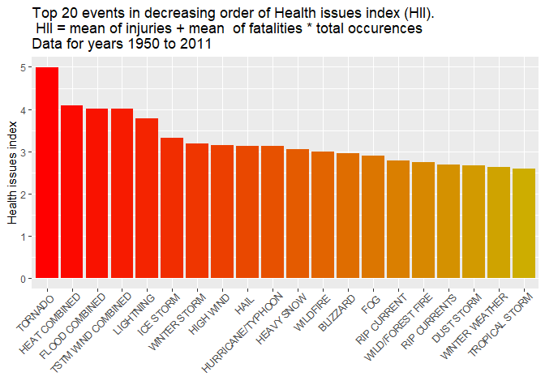

## Synopsis
The file "Storm Data" comes from the U.S. National Oceanic and Atmospheric  
Administration's (NOAA) and was accessible at [this url](https://d396qusza40orc.cloudfront.net/repdata%2Fdata%2FStormData.csv.bz2) on oct. 2nd 2019.  
  
The goal of the assessment is to produce a report that points at the most  
harmful and most costly meteorological events across the US for the years we  
have access to (1950 - 2011).  
  
More details can be found in the README.md file at [this GitHub url](https://github.com/Ravenpsycho/RepData_PeerAssessment2)

## Data Processing

### Data Loading  
We will begin by taking a look at the data:

```r
# Downloading file (47Mb, might take a while depending on the connection and speeds)
# note that this step is cached and will be executed much faster if repeated:
myurl <- "https://d396qusza40orc.cloudfront.net/repdata%2Fdata%2FStormData.csv.bz2"
if (!file.exists("Storm_Data.csv.bz2")){
        download.file(myurl, destfile = "Storm_Data.csv.bz2")
}
# Reading in the dataframe, again, might take a while.
if (!exists("StormData")){
        StormData <- read.csv("Storm_Data.csv.bz2")
}
str(StormData)
```

```
## 'data.frame':	902297 obs. of  37 variables:
##  $ STATE__   : num  1 1 1 1 1 1 1 1 1 1 ...
##  $ BGN_DATE  : Factor w/ 16335 levels "1/1/1966 0:00:00",..: 6523 6523 4242 11116 2224 2224 2260 383 3980 3980 ...
##  $ BGN_TIME  : Factor w/ 3608 levels "00:00:00 AM",..: 272 287 2705 1683 2584 3186 242 1683 3186 3186 ...
##  $ TIME_ZONE : Factor w/ 22 levels "ADT","AKS","AST",..: 7 7 7 7 7 7 7 7 7 7 ...
##  $ COUNTY    : num  97 3 57 89 43 77 9 123 125 57 ...
##  $ COUNTYNAME: Factor w/ 29601 levels "","5NM E OF MACKINAC BRIDGE TO PRESQUE ISLE LT MI",..: 13513 1873 4598 10592 4372 10094 1973 23873 24418 4598 ...
##  $ STATE     : Factor w/ 72 levels "AK","AL","AM",..: 2 2 2 2 2 2 2 2 2 2 ...
##  $ EVTYPE    : Factor w/ 985 levels "   HIGH SURF ADVISORY",..: 834 834 834 834 834 834 834 834 834 834 ...
##  $ BGN_RANGE : num  0 0 0 0 0 0 0 0 0 0 ...
##  $ BGN_AZI   : Factor w/ 35 levels "","  N"," NW",..: 1 1 1 1 1 1 1 1 1 1 ...
##  $ BGN_LOCATI: Factor w/ 54429 levels "","- 1 N Albion",..: 1 1 1 1 1 1 1 1 1 1 ...
##  $ END_DATE  : Factor w/ 6663 levels "","1/1/1993 0:00:00",..: 1 1 1 1 1 1 1 1 1 1 ...
##  $ END_TIME  : Factor w/ 3647 levels ""," 0900CST",..: 1 1 1 1 1 1 1 1 1 1 ...
##  $ COUNTY_END: num  0 0 0 0 0 0 0 0 0 0 ...
##  $ COUNTYENDN: logi  NA NA NA NA NA NA ...
##  $ END_RANGE : num  0 0 0 0 0 0 0 0 0 0 ...
##  $ END_AZI   : Factor w/ 24 levels "","E","ENE","ESE",..: 1 1 1 1 1 1 1 1 1 1 ...
##  $ END_LOCATI: Factor w/ 34506 levels "","- .5 NNW",..: 1 1 1 1 1 1 1 1 1 1 ...
##  $ LENGTH    : num  14 2 0.1 0 0 1.5 1.5 0 3.3 2.3 ...
##  $ WIDTH     : num  100 150 123 100 150 177 33 33 100 100 ...
##  $ F         : int  3 2 2 2 2 2 2 1 3 3 ...
##  $ MAG       : num  0 0 0 0 0 0 0 0 0 0 ...
##  $ FATALITIES: num  0 0 0 0 0 0 0 0 1 0 ...
##  $ INJURIES  : num  15 0 2 2 2 6 1 0 14 0 ...
##  $ PROPDMG   : num  25 2.5 25 2.5 2.5 2.5 2.5 2.5 25 25 ...
##  $ PROPDMGEXP: Factor w/ 19 levels "","-","?","+",..: 17 17 17 17 17 17 17 17 17 17 ...
##  $ CROPDMG   : num  0 0 0 0 0 0 0 0 0 0 ...
##  $ CROPDMGEXP: Factor w/ 9 levels "","?","0","2",..: 1 1 1 1 1 1 1 1 1 1 ...
##  $ WFO       : Factor w/ 542 levels ""," CI","$AC",..: 1 1 1 1 1 1 1 1 1 1 ...
##  $ STATEOFFIC: Factor w/ 250 levels "","ALABAMA, Central",..: 1 1 1 1 1 1 1 1 1 1 ...
##  $ ZONENAMES : Factor w/ 25112 levels "","                                                                                                               "| __truncated__,..: 1 1 1 1 1 1 1 1 1 1 ...
##  $ LATITUDE  : num  3040 3042 3340 3458 3412 ...
##  $ LONGITUDE : num  8812 8755 8742 8626 8642 ...
##  $ LATITUDE_E: num  3051 0 0 0 0 ...
##  $ LONGITUDE_: num  8806 0 0 0 0 ...
##  $ REMARKS   : Factor w/ 436781 levels "","-2 at Deer Park\n",..: 1 1 1 1 1 1 1 1 1 1 ...
##  $ REFNUM    : num  1 2 3 4 5 6 7 8 9 10 ...
```
  
### Check for NA's
  
From the above call to `str()` function, the database seems pretty organized.  
Let's check for missing values:

```r
na_check <- lapply(StormData, is.na)
na_check <- lapply(na_check, sum)
sort(unlist(na_check), decreasing = T)
```

```
## COUNTYENDN          F   LATITUDE LATITUDE_E    STATE__   BGN_DATE 
##     902297     843563         47         40          0          0 
##   BGN_TIME  TIME_ZONE     COUNTY COUNTYNAME      STATE     EVTYPE 
##          0          0          0          0          0          0 
##  BGN_RANGE    BGN_AZI BGN_LOCATI   END_DATE   END_TIME COUNTY_END 
##          0          0          0          0          0          0 
##  END_RANGE    END_AZI END_LOCATI     LENGTH      WIDTH        MAG 
##          0          0          0          0          0          0 
## FATALITIES   INJURIES    PROPDMG PROPDMGEXP    CROPDMG CROPDMGEXP 
##          0          0          0          0          0          0 
##        WFO STATEOFFIC  ZONENAMES  LONGITUDE LONGITUDE_    REMARKS 
##          0          0          0          0          0          0 
##     REFNUM 
##          0
```
  
We can see that the database is an "all or nothing" type: either a variable  
has (almost) all it's values filled in, or almost all the data is missing.  
  
Fortunately, in the "missing" camp, we have only two variables `F` and  
`COUNTYENDN`. Since these variables don't seem to be relevant to the questions  
at hands, we won't take further actions in their regard.  
  
### Data modifications

This will require some packages, let's load them:

```r
library(dplyr)
```

```
## 
## Attaching package: 'dplyr'
```

```
## The following objects are masked from 'package:stats':
## 
##     filter, lag
```

```
## The following objects are masked from 'package:base':
## 
##     intersect, setdiff, setequal, union
```

```r
library(ggplot2)
library(reshape2)
```

After some exploration, we can notice something about `EVTYPE`. There are  
duplicates. For example: `THUNDERSTORM WIND` appears a whole lot of times.  
This is a problem because events will need to be grouped:


```r
wind_logical <- grepl("^ *(T.*ST.*M)+ *WIND(S)*$", as.character(StormData$EVTYPE), ignore.case = T)
names_tstm <- unique(as.character(StormData[wind_logical, "EVTYPE"]))
print(names_tstm)
```

```
##  [1] "TSTM WIND"           "THUNDERSTORM WINDS"  "THUNDERSTORM WIND"  
##  [4] "THUNDERSTORM WINDSS" "THUNDERSTORM  WINDS" "TUNDERSTORM WIND"   
##  [7] "THUNDESTORM WINDS"   "THUNDERSTROM WINDS"  "THUDERSTORM WINDS"  
## [10] "THUNDERESTORM WINDS" "THUNDEERSTORM WINDS" "THUNERSTORM WINDS"  
## [13] "TSTM WINDS"          "THUNDERSTORMWINDS"   "THUNDERSTROM WIND"  
## [16] "Tstm Wind"           "Thunderstorm Wind"   " TSTM WIND"
```

This is also a problem because it appears pretty high in the list of harmful  
and costly events. I will now modify them to gather all these events under a  
new name, `TSTM WIND COMBINED`.


```r
StormData_mod <- StormData
StormData_mod[wind_logical,]$EVTYPE <- names_tstm[1]
level_nb <- which(levels(StormData_mod$EVTYPE) == names_tstm[1])
levels(StormData_mod$EVTYPE)[level_nb] <- "TSTM WIND COMBINED"
unique(as.character(StormData_mod[wind_logical, "EVTYPE"]))
```

```
## [1] "TSTM WIND COMBINED"
```
  
Much better. But there's also a problem with `HEAT`, we'll proceed the very  
same way, further altering `StormData_mod`:

```r
heat_logical <- grepl("((?!.*DROUGHT/?) *HEAT.*|.*HEAT *(?!.*DROUGHT/?))", 
                      as.character(StormData_mod$EVTYPE),
                      perl = TRUE,
                      ignore.case = T)
names_heat <- unique(as.character(StormData_mod[heat_logical, "EVTYPE"]))
print(names_heat)
```

```
##  [1] "HEAT"                   "EXTREME HEAT"          
##  [3] "EXCESSIVE HEAT"         "RECORD HEAT"           
##  [5] "HEAT WAVE"              "DROUGHT/EXCESSIVE HEAT"
##  [7] "RECORD HEAT WAVE"       "RECORD/EXCESSIVE HEAT" 
##  [9] "HEAT WAVES"             "Heatburst"             
## [11] "Record Heat"            "Heat Wave"
```


```r
StormData_mod$EVTYPE[heat_logical] <- names_heat[1]
level_nb <- which(levels(StormData_mod$EVTYPE) == names_heat[1])
levels(StormData_mod$EVTYPE)[level_nb] <- "HEAT COMBINED"
unique(as.character(StormData_mod[heat_logical, "EVTYPE"]))
```

```
## [1] "HEAT COMBINED"
```
Lastly, we will do the same with `FLOODS`:


```r
flood_logical <- grepl("^ *(FLOOD */)? *(FLASH|)+ *FLOOD(S)*(ING)*$", as.character(StormData_mod$EVTYPE),
                      ignore.case = T)
names_flood <- unique(as.character(StormData_mod[flood_logical, "EVTYPE"]))
print(names_flood)
```

```
##  [1] "FLASH FLOOD"          "FLASH FLOODING"       "FLOODING"            
##  [4] "FLOOD"                "FLASH FLOODS"         "FLOOD/FLASH FLOOD"   
##  [7] "FLOODS"               "FLOOD/FLASH FLOODING" "FLOOD/FLASHFLOOD"    
## [10] "Flood/Flash Flood"    "Flood"                " FLASH FLOOD"
```

```r
StormData_mod$EVTYPE[flood_logical] <- names_flood[1]
level_nb <- which(levels(StormData_mod$EVTYPE) == names_flood[1])
levels(StormData_mod$EVTYPE)[level_nb] <- "FLOOD COMBINED"
unique(as.character(StormData_mod[flood_logical, "EVTYPE"]))
```

```
## [1] "FLOOD COMBINED"
```


## Data Analysis
  
Now we have the tools to create a new dataframe, with data grouped by `EVTYPE`
(event type) and we'll take a look at the highest means of fatalities and injuries.

```r
health_by_event <- StormData_mod %>%
        group_by(EVTYPE) %>%
        summarize(mean.fatalities = mean(FATALITIES, na.rm = T),
                  mean.injuries = mean(INJURIES, na.rm = T),
                  total.means = mean.fatalities + mean.injuries,
                  occurences = n()) %>%
        arrange(desc(total.means))
head(health_by_event, 10)
```

```
## # A tibble: 10 x 5
##    EVTYPE              mean.fatalities mean.injuries total.means occurences
##    <fct>                         <dbl>         <dbl>       <dbl>      <int>
##  1 TROPICAL STORM GOR~           8              43          51            1
##  2 WILD FIRES                    0.75           37.5        38.2          4
##  3 THUNDERSTORMW                 0              27          27            1
##  4 TORNADOES, TSTM WI~          25               0          25            1
##  5 HIGH WIND AND SEAS            3              20          23            1
##  6 HEAT WAVE DROUGHT             4              15          19            1
##  7 SNOW/HIGH WINDS               0              18          18            2
##  8 WINTER STORM HIGH ~           1              15          16            1
##  9 HURRICANE/TYPHOON             0.727          14.5        15.2         88
## 10 GLAZE/ICE STORM               0              15          15            1
```
  
In our question we want to know how harmful an event is to population.  
My first thought was to sort the events by their total means (injuries  
and fatalities) combined as in the top 10 above.  
  
However, we first have to make sure that these events occur regularly to avoid  
putting too much weight into a deadly, harmful but also very unlikely event  
  
Let's see what the top most frequent events a.k.a. `occurences` looks like:

```r
head(health_by_event[order(health_by_event$occurences, decreasing = T),], 10)
```

```
## # A tibble: 10 x 5
##    EVTYPE             mean.fatalities mean.injuries total.means occurences
##    <fct>                        <dbl>         <dbl>       <dbl>      <int>
##  1 TSTM WIND COMBINED       0.00217         0.0290      0.0311      323430
##  2 HAIL                     0.0000520       0.00471     0.00477     288661
##  3 FLOOD COMBINED           0.0184          0.106       0.124        81070
##  4 TORNADO                  0.0929          1.51        1.60         60652
##  5 HIGH WIND                0.0123          0.0563      0.0685       20212
##  6 LIGHTNING                0.0518          0.332       0.384        15754
##  7 HEAVY SNOW               0.00809         0.0650      0.0731       15708
##  8 HEAVY RAIN               0.00836         0.0214      0.0298       11723
##  9 WINTER STORM             0.0180          0.116       0.134        11433
## 10 WINTER WEATHER           0.00470         0.0566      0.0613        7026
```
This is interesting. We can see that some newcomers like `HAIL` or  
`TSTM WIND COMBINED` occur lots of times and they **are** harmful, not top  
10 harmful but still.  
  
Let's try creating an `index` variable. It will be the product of `occurences`  
by `total.means`.  

*Why?*  
  
Because this way, if an event is occuring a very low amount of time but has  
a very harmful outcome, it will be on par with a less harmful event that  
happens much more frequently. We will log(10) this index to avoid working  
with huge numbers.  
  
Let's do this and have a look:

```r
health_by_event <- transform(health_by_event, 
                         index = log((occurences * total.means), 10))
head(health_by_event[order(desc(health_by_event$index)),], 10)
```

```
##                 EVTYPE mean.fatalities mean.injuries  total.means
## 44             TORNADO    9.287410e-02   1.506067401  1.598941502
## 21       HEAT COMBINED    1.185325e+00   3.482980333  4.668305598
## 161     FLOOD COMBINED    1.840385e-02   0.105970149  0.124373998
## 189 TSTM WIND COMBINED    2.167393e-03   0.028961445  0.031128838
## 123          LIGHTNING    5.179637e-02   0.331979180  0.383775549
## 56           ICE STORM    4.436690e-02   0.984546361  1.028913260
## 159       WINTER STORM    1.801802e-02   0.115542727  0.133560745
## 179          HIGH WIND    1.226994e-02   0.056253711  0.068523649
## 200               HAIL    5.196407e-05   0.004714873  0.004766837
## 9    HURRICANE/TYPHOON    7.272727e-01  14.488636364 15.215909091
##     occurences    index
## 44       60652 4.986678
## 21        2644 4.091421
## 161      81070 4.003590
## 189     323430 4.002943
## 123      15754 3.781468
## 56        2006 3.314710
## 159      11433 3.183839
## 179      20212 3.141450
## 200     288661 3.138618
## 9           88 3.126781
```


```r
plotpop <- head(health_by_event[order(desc(health_by_event$index)),], 20)
plotpop$EVTYPE <- factor(plotpop$EVTYPE, levels = as.character(plotpop$EVTYPE))

warncolors <- colorRampPalette(c("red", "gold3"))
g1 <- ggplot(plotpop[c(1:6)],
             aes(x=EVTYPE, y = index, fill = EVTYPE))
g1 + geom_bar(stat = "identity", position = "dodge") +
        ylab("Health issues index")+
        xlab(element_blank())+
        theme(legend.position = "none")+
        scale_fill_manual(values = warncolors(20))+
        theme(axis.text.x = element_text(angle = 45, hjust = 0.95)) +
        labs(title = paste0("Top 20 events in decreasing order of Health issues",
                            " index (HII).\n HII = mean of injuries + mean ",
                            " of fatalities * total occurences\nData for ",
                            "years 1950 to 2011"))
```

<!-- -->
  
Let's do the same with cost, using two new variables, `PROPDMG` and `CROPDMG`,  
holding numbers for *property damage* and *crop damage*, respectively, they  
first have to be ajusted with their exponent `EXP` counteparts:

```r
## Modifying CROPDMGEXP
StormData_mod$CROPDMGEXP <- as.character(StormData_mod$CROPDMGEXP)
StormData_mod$CROPDMGEXP <- gsub(
        "[0-9]", "10", StormData_mod$CROPDMGEXP)
StormData_mod$CROPDMGEXP <- gsub(
        "^$", "0", StormData_mod$CROPDMGEXP)
StormData_mod$CROPDMGEXP <- gsub(
        "^[?]$", "0", StormData_mod$CROPDMGEXP)
StormData_mod$CROPDMGEXP <- gsub(
        "[kK]", "1000", StormData_mod$CROPDMGEXP)
StormData_mod$CROPDMGEXP <- gsub(
        "[mM]", "1000000", StormData_mod$CROPDMGEXP)
StormData_mod$CROPDMGEXP <- gsub(
        "[Bb]", "1000000000", StormData_mod$CROPDMGEXP)
StormData_mod$CROPDMGEXP <- as.numeric(StormData_mod$CROPDMGEXP)

##Same for PROPDMGEXP
StormData_mod$PROPDMGEXP <- as.character(StormData_mod$PROPDMGEXP)
StormData_mod$PROPDMGEXP <- gsub(
        "[0-9]", "10", StormData_mod$PROPDMGEXP)
StormData_mod$PROPDMGEXP <- gsub(
        "^$", "0", StormData_mod$PROPDMGEXP)
StormData_mod$PROPDMGEXP <- gsub(
        "[+]", "1", StormData_mod$PROPDMGEXP)
StormData_mod$PROPDMGEXP <- gsub(
        "^[?-]$", "0", StormData_mod$PROPDMGEXP)
StormData_mod$PROPDMGEXP <- gsub(
        "[hH]", "100", StormData_mod$PROPDMGEXP)
StormData_mod$PROPDMGEXP <- gsub(
        "[kK]", "1000", StormData_mod$PROPDMGEXP)
StormData_mod$PROPDMGEXP <- gsub(
        "[mM]", "1000000", StormData_mod$PROPDMGEXP)
StormData_mod$PROPDMGEXP <- gsub(
        "[Bb]", "1000000000", StormData_mod$PROPDMGEXP)
StormData_mod$PROPDMGEXP <- as.numeric(StormData_mod$PROPDMGEXP)
```


```r
cost_by_event <- StormData_mod %>%
        group_by(EVTYPE) %>%
        summarise(mean.prop = mean(PROPDMG * PROPDMGEXP, na.rm = T),
                  mean.crop = mean(CROPDMG * CROPDMGEXP, na.rm = T),
                  mean.combi = mean.crop + mean.prop,
                  occurences = n(),
                  index = log(mean.combi*occurences, 10)) %>%
        arrange(desc(index))
head(cost_by_event[order(desc(cost_by_event$mean.combi)),])
```

```
## # A tibble: 6 x 6
##   EVTYPE                   mean.prop  mean.crop mean.combi occurences index
##   <fct>                        <dbl>      <dbl>      <dbl>      <int> <dbl>
## 1 TORNADOES, TSTM WIND,~ 1600000000   2500000       1.60e9          1  9.20
## 2 HEAVY RAIN/SEVERE WEA~ 1250000000         0       1.25e9          2  9.40
## 3 HURRICANE/TYPHOON       787566364. 29634918.      8.17e8         88 10.9 
## 4 HURRICANE OPAL          352538444.  2111111.      3.55e8          9  9.50
## 5 STORM SURGE             165990559.       19.2     1.66e8        261 10.6 
## 6 WILD FIRES              156025000         0       1.56e8          4  8.80
```
If we arrange the data by `mean.combi` (as seen above), we can see that the  
most costly events have a very low occurence. Since the goal of this analysis  
is to produce a report supposedly for preparation towards events, the formerly  
used method of creating an index to weight events by `occurences` seems about  
right.

```r
head(cost_by_event, 20)
```

```
## # A tibble: 20 x 6
##    EVTYPE                  mean.prop  mean.crop mean.combi occurences index
##    <fct>                       <dbl>      <dbl>      <dbl>      <int> <dbl>
##  1 FLOOD COMBINED           1990914.    88841.      2.08e6      81070 11.2 
##  2 HURRICANE/TYPHOON      787566364. 29634918.      8.17e8         88 10.9 
##  3 TORNADO                   938752.     6842.      9.46e5      60652 10.8 
##  4 STORM SURGE            165990559.       19.2     1.66e8        261 10.6 
##  5 HAIL                       54501.    10483.      6.50e4     288661 10.3 
##  6 DROUGHT                   420461.  5615983.      6.04e6       2488 10.2 
##  7 HURRICANE               68208730. 15758103.      8.40e7        174 10.2 
##  8 TSTM WIND COMBINED         30035.     3585.      3.36e4     323430 10.0 
##  9 RIVER FLOOD             29589280. 29072017.      5.87e7        173 10.0 
## 10 ICE STORM                1966564.  2503546.      4.47e6       2006  9.95
## 11 TROPICAL STORM          11165059.   983110.      1.21e7        690  9.92
## 12 WINTER STORM              585017.     2357.      5.87e5      11433  9.83
## 13 HIGH WIND                 260738.    31594.      2.92e5      20212  9.77
## 14 WILDFIRE                 1725865.   107017.      1.83e6       2761  9.70
## 15 STORM SURGE/TIDE        31359378.     5743.      3.14e7        148  9.67
## 16 HURRICANE OPAL         352538444.  2111111.      3.55e8          9  9.50
## 17 WILD/FOREST FIRE         2060281.    73299.      2.13e6       1457  9.49
## 18 HEAVY RAIN/SEVERE WE~ 1250000000         0       1.25e9          2  9.40
## 19 TORNADOES, TSTM WIND~ 1600000000   2500000       1.60e9          1  9.20
## 20 HEAVY RAIN                 59221.    62561.      1.22e5      11723  9.15
```


```r
plotpop2 <- head(cost_by_event[order(desc(cost_by_event$index)),], 20)
plotpop2$EVTYPE <- factor(plotpop2$EVTYPE, levels = as.character(plotpop2$EVTYPE))

prettycolors2 <- colorRampPalette(c("darkgreen", "springgreen"))
g2 <- ggplot(plotpop2[c(1:6)],
             aes(x=EVTYPE, y = index, fill = EVTYPE))
g2 + geom_bar(stat = "identity", position = "dodge") +
        ylab("Cost Index")+
        xlab(element_blank())+
        theme(legend.position = "none")+
        scale_fill_manual(values = prettycolors2(20))+
        theme(axis.text.x = element_text(angle = 65, hjust = 0.95)) +
        labs(title = paste0("Top 20 events in decreasing order of Cost",
                            " Index (CI).\n CI = mean of propriety damage +",
                            " mean of crop damage ",
                            "* total occurences\nData for ",
                            "years 1950 to 2011"))
```

<!-- -->
  
I will rest my case here. Further steps should be taken to be able to consider  
this work for anything else than a simple assessment in the JH Datascience  
course:  
  
* In depth cleaning of the `EVTYPE` variable to ensure the best merge of duplicates.
* Regional repartition to further affinate the specific risk potential.
* Ajusting the index, especially for health, to reflect the true impact on  
a community
